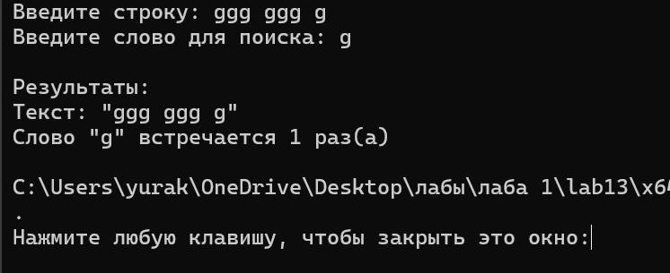

# Домашняя работа к лабораторной работе 11.
## Условия задачи:
Сумму элементов массива, расположенных после минимального по
модулю элемента.

## 1. Алгоритм и блок схема:
### Алгоритм:
1. **Начало**
2. Объявить переменные:
  - `array[N]` - массив
  - `sum` = 0.0 - сумма
  - `min_abs_value, min_abs_index` - вспомогательные переменные
3.  Цикл от 0 до 10:
   - Ввод переменной: `array[i]`
4. Присвоение переменных:
   - `min_abs_value` = fabs(`array[0]`)
   - `min_abs_index` = 0
5. Цикл от 0 до 10:
   - `abs_value` = fabs(`array[i]`)
     5.1. Проверка условия: `abs_value` < `min_abs_value`
     - Да
           - `min_abs_value` = `abs_value`
           - `min_abs_index` = `i`
6. Проверка условия: `min_abs_index` < 10 - 1
- Да
  6.1. Цикл от 0 до 10:
        - `sum` += `array[i]`
7. Вывести результаты расчётов с подстановкой значений в текст.
8. **Конец**

### Блок схема

## 2. Реализация программы:
```
#define _CRT_SECURE_NO_DEPRECATE
#include <stdio.h>
#include <math.h>
#include <locale.h>

#define N 10

int main() {
    setlocale(LC_ALL, "");
    float array[N];
    int i;
    float sum = 0.0;
    float min_abs_value;
    int min_abs_index;

    printf("Введите %d элементов массива:\n", N);
    for (i = 0; i < N; i++) {
        printf("array[%d] = ", i);
        scanf("%f", &array[i]);
    }

    min_abs_value = fabs(array[0]);
    min_abs_index = 0;

    for (i = 1; i < N; i++) {
        float abs_value = fabs(array[i]);
        if (abs_value < min_abs_value) {
            min_abs_value = abs_value;
            min_abs_index = i;
        }
    }

    if (min_abs_index < N - 1) {
        for (i = min_abs_index + 1; i < N; i++) {
            sum += array[i];
        }
    }

    printf("\nРезультаты:\n");
    printf("Минимальный по модулю элемент: array[%d] = %.4f\n", min_abs_index, array[min_abs_index]);
    printf("Сумма элементов после него: %.4f\n", sum);

    return 0;
}
```
## 3. Результат работы программы

## 4. Информация о разработчике
Капичников Юрий, бИПТ-252
