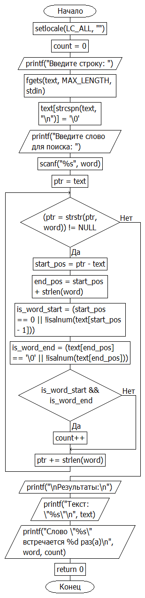

# Домашняя работа к лабораторной работе 11.
## Условия задачи:
Сумму элементов массива, расположенных после минимального по
модулю элемента.

## 1. Алгоритм и блок схема:
### Алгоритм:
1. **Начало**
2. Объявить переменные:
  - `MAX_LENGTH` = 200
  - `text[MAX_LENGTH]`
  - `word[MAX_LENGTH]`
  - `ptr`
  - `count` = 0
4.  Ввод:
    - `word`
4. Присвоение переменных:
   `ptr` = `text`
5. Цикл пока не кончится `word`:
  - `start_pos` = `ptr` - `text`
  - `end_pos` = `start_pos` + strlen(`word`)
  - `is_word_start` = (`start_pos` == 0 || !`isalnum`(`text[start_pos - 1]`))
  - `is_word_end` = (`text[end_pos]` == '\0' || !`isalnum(text[end_pos]`))
    5.1 Проверка условия `is_word_start` && `is_word_end`:
        - `count`++
  - `ptr` += strlen(`word`)
6. Вывести результаты расчётов с подстановкой значений в текст.
7. **Конец**

### Блок схема

## 2. Реализация программы:
```
#define _CRT_SECURE_NO_DEPRECATE
#include <locale.h>
#include <stdio.h>
#include <string.h>
#include <ctype.h>

#define MAX_LENGTH 200

int main() {
    setlocale(LC_ALL, "");
    char text[MAX_LENGTH];
    char word[MAX_LENGTH];
    char* ptr;
    int count = 0;

    printf("Введите строку: ");
    fgets(text, MAX_LENGTH, stdin);

    text[strcspn(text, "\n")] = '\0';

    printf("Введите слово для поиска: ");
    scanf("%s", word);

    ptr = text;
    while ((ptr = strstr(ptr, word)) != NULL) {
        int start_pos = ptr - text;
        int end_pos = start_pos + strlen(word);

        int is_word_start = (start_pos == 0 || !isalnum(text[start_pos - 1]));
        int is_word_end = (text[end_pos] == '\0' || !isalnum(text[end_pos]));

        if (is_word_start && is_word_end) {
            count++;
        }

        ptr += strlen(word); 
    }

    printf("\nРезультаты:\n");
    printf("Текст: \"%s\"\n", text);
    printf("Слово \"%s\" встречается %d раз(а)\n", word, count);

    return 0;
}
```
## 3. Результат работы программы

## 4. Информация о разработчике
Капичников Юрий, бИПТ-252
